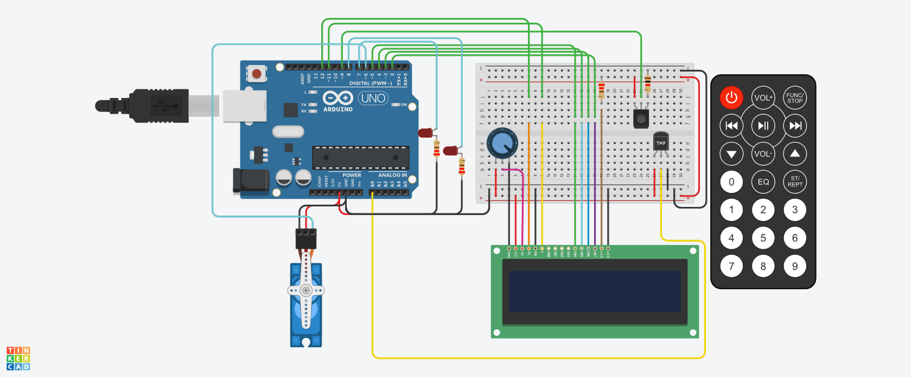
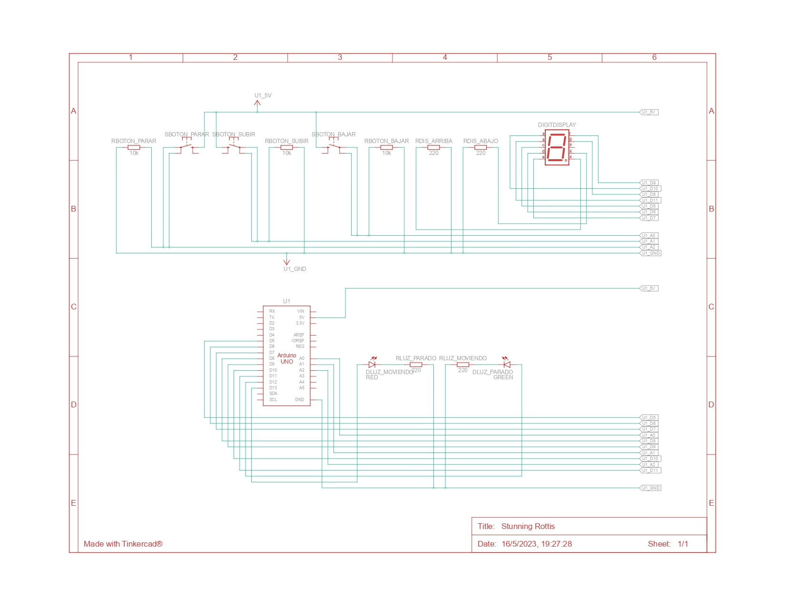

# SPD-Sistema-anti-incendios

## Examen: antiincendios

## objetivo del proyecto
El objetivo de este proyecto es realizarun sistema que muestre la estacion actual y la temperatura hasta que se determina que hay un incendio y se activa el sistema antiincendio.

### Configuracion inicial y definicion de variables.
Aqui se establecen los puertos utilizados asignadoles una denominacion, se inicializan las variables y se establece la configuacion inicial indicando la modalidad de cada puerto como el estado de dichos puertos

~~~~
#include <LiquidCrystal.h>
#include <IRremote.h>
#include <Servo.h>

/*	definicion de puertos	*/
#define led 8
#define led_servo_mov 13
#define sensorIR 9
/*	definicion de valor de tecla IR	*/
#define Tecla_1 0xEF10BF00
/*	inicializacion de variables	*/
int temperatura = 0;
int pos = 0;
int rojo = 0;
int verde = 0;
int azul = 0;
/*	creacion de objetos	*/
LiquidCrystal lcd_1(12, 11, 5, 4, 3, 2);
Servo servo_6;
/*		*/
void setup()
{
	/*	configuracion de puertos	*/
	pinMode(led, OUTPUT);
	pinMode(led_servo_mov, OUTPUT);
  	/*	configuracion inicial lcd	*/
  	lcd_1.begin(16, 2);
  	lcd_1.print("Primavera");
    lcd_1.setCursor(0, 1);
  	lcd_1.print("temp");
	/*	habilitacion del senso IR	*/
    IrReceiver.begin(sensorIR, DISABLE_LED_FEEDBACK);
  	/*	congiguracion de objeto servo	*/
	servo_6.attach(6, 500, 2500);
  	servo_6.write(pos);
}

~~~~

### Loop y funciones pincipales.
Dentro del loop se encuenta el codigo que se ejecuta continuamente y luego las funciones pincipales las cuales son las mas importantes.

* **Loop**
~~~~
void loop(){
  	/*	lectura de tempeatua y procesamiento de valor	*/
    temperatura = analogRead(A0);
    temperatura = map(temperatura,20,358,-40,125);
  	/*	determinar y mostrar estacion segun temperatura	*/
  	if(temperatura < 43 && digitalRead(led) == LOW){
      	
    	determinar_estacion();
	}
  	/*	decodificacion de señales con sus ordenes	*/
  	control_hacer();
  	/*	sistema de incendio	*/
  	incendio();
 	
  	delay(1000);

}
~~~~

#### funciones principales.

~~~~

void determinar_estacion(){
  	lcd_1.clear();
    if  (temperatura < 7){
        lcd_1.print("Invierno");
    }else if (temperatura < 15){
      	lcd_1.print("Otonio");
    }else if (temperatura < 26){
       	lcd_1.print("Primavera");
    }else if (temperatura < 42){
        lcd_1.print("Verano");
    }else incendio();
  	lcd_1.setCursor(0, 1);
  	lcd_1.print("temp  ");
    lcd_1.print(temperatura);
}

void control_hacer(){
	if (IrReceiver.decode()){
      	if (IrReceiver.decodedIRData.decodedRawData == Tecla_1 && digitalRead(led) == HIGH){
			digitalWrite(led, LOW);
      	}else if (IrReceiver.decodedIRData.decodedRawData == Tecla_1){
			digitalWrite(led, HIGH);
      	}
		IrReceiver.resume();
	}
}

void incendio(){
    if( (temperatura <= 42 && digitalRead(led) == LOW) && pos > 0 ){
        mensaje_cerrando();
        cerrar_valvula();
    }else if(( temperatura >= 42 || digitalRead(led) == HIGH) && pos == 0 ){
        mensaje_abriendo();
        abrir_valvula();
    }
}
~~~~

### Funciones subprincipales.

~~~~
void abrir_valvula(){
  digitalWrite(led_servo_mov, HIGH);
    for (pos = 0; pos <= 180; pos += 1) {
        servo_6.write(pos);
        delay(5);
    }
  digitalWrite(led_servo_mov, HIGH);
}
void mensaje_abriendo() {
  lcd_1.clear();
  lcd_1.print("abriendo");
  lcd_1.setCursor(0, 1);
  lcd_1.print("valvula");

}
void mensaje_incendio(){
  lcd_1.clear();
  lcd_1.print("sistema");
  lcd_1.setCursor(0, 1);
  lcd_1.print("activado");
  
}

void cerrar_valvula(){
  	digitalWrite(led_servo_mov, HIGH);
    for (pos = 180; pos >= 0; pos -= 1) {
      servo_6.write(pos);
      delay(5);
    }
    digitalWrite(led_servo_mov, HIGH);
}
void mensaje_cerrando(){
  lcd_1.clear();
  lcd_1.print("cerando");
  lcd_1.setCursor(0, 1);
  lcd_1.print("valvula");
  
}
~~~~

## Link al proyecto.
- [proyecto](https://www.tinkercad.com/things/399n3WSI8cf?sharecode=cKYD69gVAuYqY1NP2EkLe8Y94M03s2RZ9MUkw7xP8WQ)
